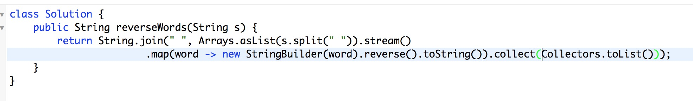

[Reverse Words in a String III](https://leetcode.com/problems/reverse-words-in-a-string-iii/description/)

这道题我的方法是递归，递归思路看代码很容易理解。

我写了个`reverseWord()`方法来翻转单个单词，Java 的`StringBuilder`有个`reverse()`方法可以翻转字符，如下

`String after = new StringBuilder(before).reverse().toString();`

最后查各种函数，想出一个one line solution:

